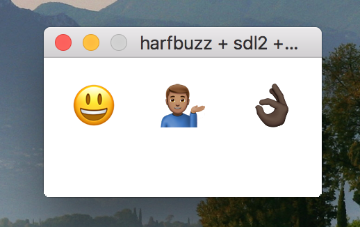

# ex-harfbuzz-sdl2-cairo-freetype-emoji



## Usage
`./ex-harfbuzz-sdl2-cairo-freetype-emoji font-file.ttf text`

## Requirements

Tested on :
```
macOS High Sierra
harzbuff -> 1.8.2
cairo -> 1.15.12
freetype -> 2.9.1
sdl2 -> 2.0.8
pkg-config -> 0.29.2
```
